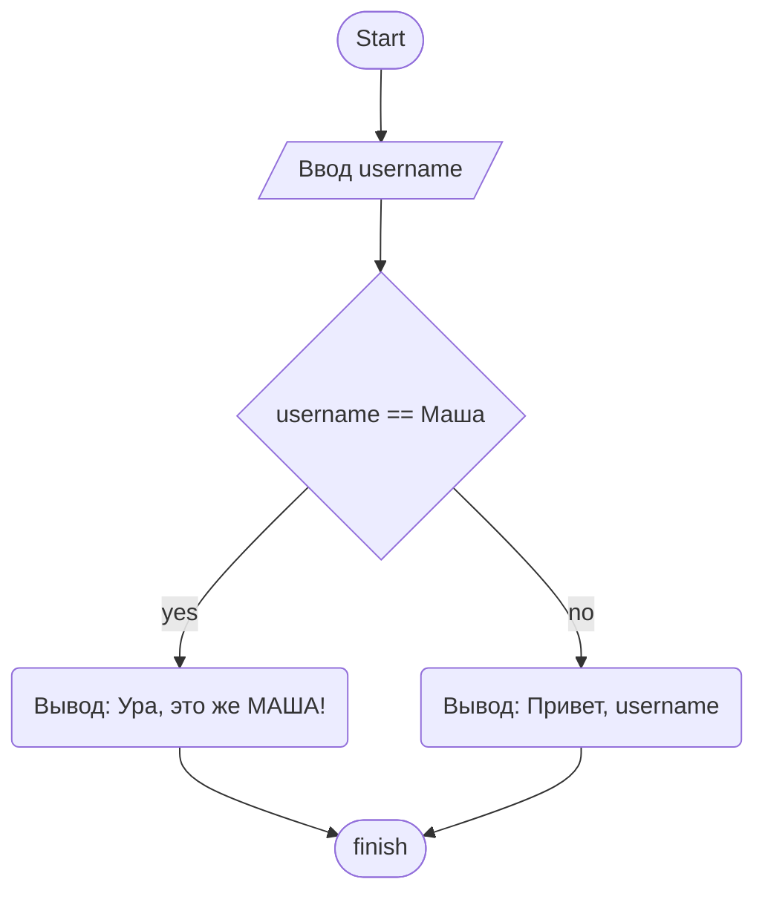

## Урок 1. Знакомство с языком программирования C#
---------------------------------------------------
### Первые шаги написания программы

- Получить задачу
- Обдумать условие
- Уточнить условие
- Составить алгоритм
- Уточнить алгоритм
- Исправить алгоритм
- Перепроверить алгоритм
- Начать писать писать код, но это не точно

Создать новый проект C#

    $ dotnet new console

Запустить проект

    $ dotnet run

`Через Console мы обращаемся к системному
терминалу`

### Синтаксис

> `Write();` Вывод в одну строку

> `WriteLine();` В конце перейти на новую строку

> `ReadLine();` Считать строку из терминала

> `new Random().Next(min, max);` даст случайное целое число от min до max-1 [min, max-1] или [min, max)

#### **Типы данных**

|Тип данных|Диапазон                           |Размер                            |
|----------|-----------------------------------|----------------------------------|
|int       |От -2 147 483 648 до 2 147 483 647 |От -2 147 483 648 до 2 147 483 647|
|double    |от ±5,0 × 10−324 до ±1,7 × 10308   |64-разрядное целое число со знаком|
|string    |от 0 до много символов             |от 4 байт до 2 гб                 |
|bool      |true и false                       |1 байт                            |

Пример с Машой

## Урок 2. Знакомство с функциями и массивами
---------------------------------------------------
### Функции в программировании

$f(x) = x^2 + 1$

$y = x^2 + 1$

$f(5) = 5^2 + 1$

$f(5) = 26$

$(1^2 + 1) + (2^2 + 1) + (3^2 + 1) + (4^2 + 1) + (5^2 + 1)$

$f(1) + f(2) + f(3) + f(4) + f(5)$

$\displaystyle\sum_{k=0}^5ƒ(k)$

	$ double f(double x)
	{
	double result = x * x + 1;
	return result
	}

	ВозвращаемыйТипДанных ИмяМетода([ТипДанных1 ИмяАргумента1, ... ])
	{
	Тело Метода
	return ЗначениеСоответствующееВозвращаемомуТипуДанных;
	}

### В начале было “стихийно”

	// Первый вариант поиска максимального значения
	Write("Введите значение: ");
	int a = ToInt32(ReadLine());
	Write("Введите значение: ");
	int b = ToInt32(ReadLine());
	Write("Введите значение: ");
	int c = ToInt32(ReadLine());
	Write("Введите значение: ");
	int d = ToInt32(ReadLine());
	Write("Введите значение: ");
	int e = ToInt32(ReadLine());
	Write("Введите значение: ");
	int f = ToInt32(ReadLine());
	Write("Введите значение: ");
	int g = ToInt32(ReadLine());
	Write("Введите значение: ");
	int h = ToInt32(ReadLine());
	Write("Введите значение: ");
	int i = ToInt32(ReadLine());

	int max = 0;

	if (max > a) max = a;
	if (max > b) max = b;
	if (max > c) max = c;
	if (max > d) max = d;
	if (max > e) max = e;
	if (max > f) max = f;
	if (max > g) max = g;
	if (max > h) max = h;
	if (max > i) max = i;
----------------------------------

	// Второй вариант кода максимального значения
	int Max(int arg1, int arg2, int arg3);
	{
		int result = 0;
		if (arg1 > result) result = arg1;
		if (arg2 > result) result = arg2;
		if (arg3 > result) result = arg3;
		return result;
	}
	int GetData()
	{
		Write("Введите значение: ");
		return ToInt32(ReadLine());
	}

	int a = GetData();
	int b = GetData();
	int c = GetData();
	int d = GetData();
	int e = GetData();
	int f = GetData();
	int g = GetData();
	int h = GetData();
	int i = GetData();

	int max = Max(
			Max(a, b, c),
			Max(d, e, f),
			Max(g, h, i));

	int max = Max(max);
	
--------------------------

	// Третьи вариант кода поиска максимального значения
	int Max(int arg1, int arg2, int arg3);
	{
		int result = 0;
		if (arg1 > result) result = arg1;
		if (arg2 > result) result = arg2;
		if (arg3 > result) result = arg3;
		return result;
	}
	int GetData()
	{
		Write("Введите значение: ");
		return ToInt32(ReadLine());
	}
	int max = Max(
				  Max(GetData(), GetData(), GetData()),
				  Max(GetData(), GetData(), GetData()),
				  Max(GetData(), GetData(), GetData()),
				);

-------------------------------------------------------

Имеется одномерный массив array из n элементов, требуется найти элемент массива, равный find
1. Установить счетчик index в позицию 0
2. Если array [index] = find, алгоритм завершил работу успешно.
3. Увеличить index на 1
4. Если index < n, то перейти к шагу 2. В противном случае алгоритм завершил работу безуспешно.
___________________________________________________

	int[] array = {1, 12, 31, 4, 15, 16, 17, 18};
	int n = array.Lenght;
	int find = 4;

	int index = 0;

	while (index < n)
	{
		if (array[index] == find)
		{
			Console.WriteLIne(index);
			break;
		}
		index++;
	}

---------------------------------------

	void FillArray(int[] collection)
	{
		int lenght = collection.Lenght;
		int index = 0;
		while (index < lenght)
		{
			collection[index] = new Random().Next(1, 10);
			index++;
		}
	}

	void PrintArray(int[] col)
	{
		int count = col.Lenght;
		int position = 0;
		while (position < count)
		{
			Console.WriteLine(col[position]);
			position++;
		}
	}

	int[] array = new int[10];

	FillArray(array);
	PrintArray(array);

## Урок 3. Функции: продолжение
-------------------------------
	// Вид 1 - ничего не принимают, ничего не возвращают
	void Method1()
	{
		Console.WriteLine("Автор ...");
	}
	Method1();

	// Вид 2 - что-то принимают, ничего не возвращают
	void Method2(string msg, int count)
	{
		int i = 0;
		while (i < count)
		{
			Console.WriteLine(msg);
			i++;
		}
	}
	Method2(msg: "Текст сообщения", count: 4);

	// Вид 3 - ничего не принимают, что-то возвращают
	int Method3()
	{
		return DateTime.Now.Year;
	}
	intt year = Method3();
	Console.WriteLine(year);

	// Вид 4 - что-то принимают, что-то возвращают
	string Method4(int count, string text)
	{
		int i = 0;
		string result = String.Empty;
		while (i < count)
		{
			result = result + text;
			i++;
		}
		return result;
	}
	string res = Method4(10, "abc");
	Console.WriteLine(res);

$ƒ(x) = x^2 + 1$

	double f(double x)
	{
		double result = x * x + 1;
		return result;
	}

### Цикл

	for(int i = 0; i < 10; i++)
	{
		Console.WriteLine(i);
	}

### Цикл в цикле

	for(int i = 0; i < 10; i++)
	{
		for(int j = 0; j < 10; j++)
		{
			Console.WriteLine(i * j);
		}
		Console.WriteLine();
	}

Циклов много не бывает
Бывают циклы в циклах:
- ничего не принимают, ничего не возвращают
- что-то принимают, ничего не возвращают
- ничего не принимают, что-то возвращают
- что-то принимают, что-то возвращают

	// Дан текст. В тексте нужно все пробелы заменить черточками,
	// маленькие буквы “к” заменить большими “К”, а большие “С” заменить
	// маленькими “с”.

	string text = "— Я думаю, — сказал князь, улыбаясь, — что, "
							+ "ежели бы вас послали вместо нашего милого "
							+ "Винценгероде, вы бы взяли приступом согласие "
							+ "прусского короля. Вы так красноречивы. Вы "
							+ "дадите мне чаю?";
	string Replace(string text, char oldValue, char newValue)
	{
		string result = String.Empty;
		int length = text.Length;
		for (int i =0; i < length; i++)
		{
			if (text[i] == oldValue) result = result + $"{newValue};
			else result = result + $"{text[i]}";
		}

		return result;
	}

	string newText = Replace(text, ' ', '|');
	Console.WriteLine(newText);
	Console.WriteLine();
	newText = Replace(text, 'к', 'К');
	Console.WriteLine(newText);

---------------------------------------------------------------------

	// 1. Найти позицию минимального элемента в неотсортированной части массива
	// 2. Произвести обмен этого значения со значением первой неотсортированной позиции
	// 3. Повторять пока есть не отсортированные элементы

	int[] arr = { 1, 8, 3, 2, 6, 4, 5, 7 };

	void PrintArry(int[] array)
	{
		int count = array.Length;

		for (int i = 0; i < count; i++)
		{
			Console.WriteLine($"{array[i]} ");
		}
		Console.WriteLine();
	}
	void SelectionSort(int[] array)
	{
		for (int i = 0; i < array.Length; i++)
		{
			int minPosition = i;
			
			for (int j = i + 1; j < array.Length; j++)
			{
				if(array[j] < array[minPosition]) minPosition = j;
			}
			
			int temporary = array[i];
			array[i] = array[minPosition];
			array[minPosition] = temporary;
		}
	}

	PrintArray(arr);
	SeletionSort(arr);

